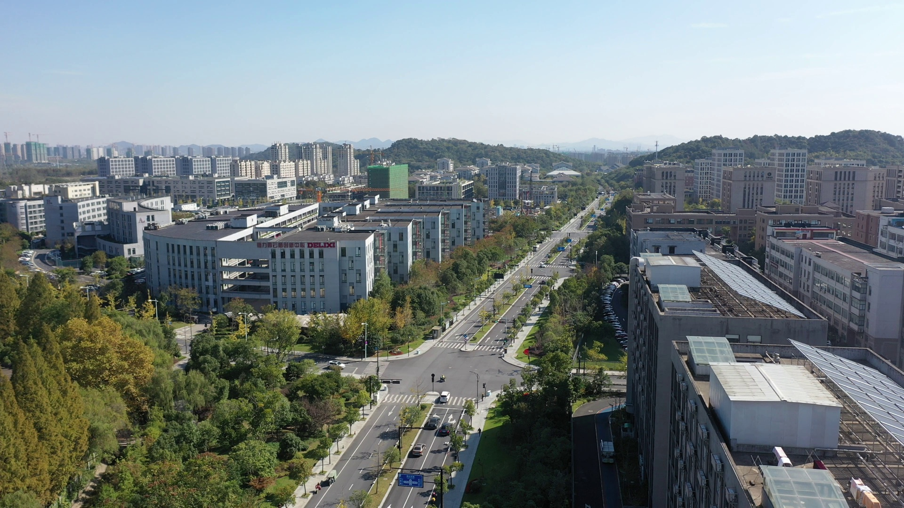
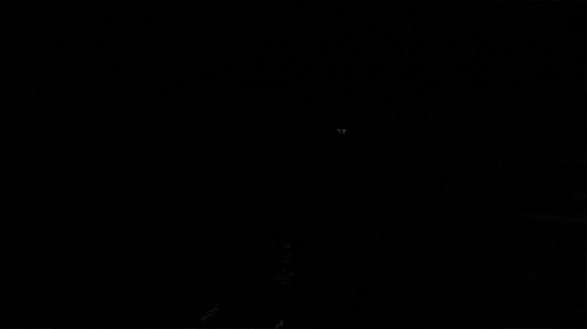

# YOLOMG mask32 pipeline

## What mask32 is

`mask32` is a motion image made before the detector runs. It is not a layer inside YOLOMG.

```text
three video frames -> OpenCV motion processing -> one motion-mask image
RGB target image + motion-mask image -> YOLOMG -> drone boxes
```

The model receives two images of the same moment:

```text
Input 1: normal RGB frame
Input 2: mask32 motion image
```

## Example input pair

The repository includes matching examples for `phantom05_0606`.

| RGB frame | Motion mask |
| --- | --- |
|  |  |

The RGB image tells the model what the scene looks like. The motion mask tells it where pixels changed after camera movement was reduced.

## Full pipeline

For target frame `t`, the original generator uses two neighbors:

```text
frame t-2                 frame t                 frame t+2
   earlier                 target                    later
      |                       |                        |
      |---- compensate ------>|<------ compensate ------|
      |                       |                        |
      +-- residual 1 ---------+--------- residual 2 ----+
                                  |
                                  v
                        average both residuals
                                  |
                                  v
                          mask32 for frame t
```

The code steps are:

1. Read frames `t-2`, `t`, and `t+2`.
2. Blur every frame with an 11×11 Gaussian blur and convert it to grayscale.
3. Track a grid of background points from an outer frame to target frame `t` with KLT optical flow.
4. Use RANSAC to fit a homography from the matches that agree on one shared camera movement.
5. Warp the outer frame into target frame `t`'s camera view.
6. Calculate the absolute residual between the warped frame and target frame.
7. Repeat for the other outer frame.
8. Average the two residual images and save/use the result as the mask.

## How it reduces camera movement

If the camera pans right, buildings and roads appear to move left in the image. A plain frame difference makes the entire scene bright.

mask32 first estimates that shared background shift, then warps the neighboring frame so the building pixels line up with the target frame:

```text
without compensation
earlier building: x=500
target building:  x=480
difference: bright, even though the building did not move

after compensation
warped building:  x=480
target building:  x=480
difference: dark
```

A drone moves independently of the camera. It still does not align after the background warp, so it remains bright in the residual.

RANSAC helps by rejecting tracks from the drone, moving cars, and bad optical-flow matches when it chooses the camera transform.

## Original implementation

| File | Responsibility |
| --- | --- |
| [`test_code/generate_mask5.py`](../test_code/generate_mask5.py) | Reads complete videos and calls the mask generator. |
| [`test_code/FD5_mask.py`](../test_code/FD5_mask.py) | Creates two residuals and averages them into `mask32`. |
| [`test_code/MOD_Functions.py`](../test_code/MOD_Functions.py) | Implements KLT tracking, RANSAC homography fitting, and perspective warping. |

The original code is an offline data-generation script. It writes images to an old hard-coded path and does not return a reusable mask image for an application.

## New reusable implementation

[`video_detector_mask32.py`](../video_detector_mask32.py) is the second video application. It keeps the same main idea but removes old paths and file-writing side effects.

### `compensated_frame(source, target)`

This function:

```text
source grayscale frame
      |
KLT grid optical flow
      |
RANSAC homography
      |
warpPerspective
      |
compensated source in target camera view
```

It returns the source frame after camera-motion alignment.

### `mask32(earlier, target, later)`

This function makes the final three-channel motion input:

```python
residual_previous = abs(target - compensate(earlier, target))
residual_future = abs(target - compensate(later, target))
mask = average(residual_previous, residual_future)
```

The grayscale result is copied into three channels because the detector expects a three-channel second image input.

### Video buffering

The application stores five frames. When frame `t+2` arrives, it can process the center frame `t`:

```text
buffer: [t-2, t-1, t, t+1, t+2]
                     ^
              detect this target frame
```

This is why mask32 inference has a two-frame delay. At 30 FPS, that is about 67 ms before model inference time.

## Run it

Check the camera-compensation implementation without opening a video:

```bash
uv run python video_detector_mask32.py --self-check
```

Choose an ARD100 video:

```bash
uv run python video_detector_mask32.py
```

Run one video directly:

```bash
uv run python video_detector_mask32.py \
  --source /home/user/datasets/ARD100/train_videos/phantom09.mp4
```

The annotated output is written to:

```text
runs/detect/<video-name>_mask32_detected.mp4
```

## Important limits

- One homography cannot perfectly align objects at very different distances during sideways camera movement; this is called parallax.
- Blank sky, blur, and fast rotation can leave too few good KLT tracks.
- The original code creates a warp-border validity mask but does not apply it to the final residual. This can leave bright edges after a strong warp.
- Training and inference must use the same mask method. A model trained on original mask32 images should use this compensated pipeline, not only simple consecutive-frame differences.
